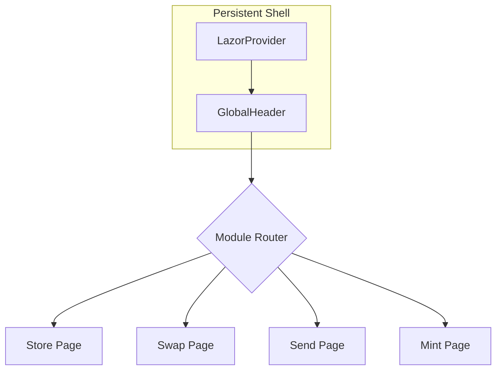

# ⚡ LazorPay Hub

> **The Ultimate Checkout Suite for Solana.**
> A production-ready reference implementation for Passkey Authentication and Gasless Transactions using LazorKit.


## 🌟 The Vision
LazorPay Hub isn't just a demo—it's a **product suite**. We re-imagined the Web3 onboarding experience to prove that crypto apps can feel as seamless as Web2 fintech.

**No Seed Phrases. No Extensions. Just FaceID.**

### ✨ The 4-Module Suite
1.  **🛍️ Virtual Store:** A complete e-commerce flow with cart simulation and instant settlement.
2.  **🔄 DeFi Swap:** Zero-fee token swaps demonstrating the power of **Gasless Transactions**.
3.  **💸 P2P Transfer:** Instant "CashApp-style" payments using biometrics.
4.  **🎨 NFT Creator:** Upload assets and mint Compressed NFTs directly on-chain.

---

## 🚀 Quick Start

### Prerequisites
* Node.js 18+
* A modern browser with WebAuthn support (Chrome, Safari, Edge).
* **HTTPS Environment** (Required for Passkeys). *Localhost is whitelisted by default.*

### Installation

1.  **Clone the Repo**
    ```bash
    git clone [https://github.com/YOUR_USERNAME/lazorpay-hub.git](https://github.com/YOUR_USERNAME/lazorpay-hub.git)
    cd lazorpay-hub
    ```

2.  **Install Dependencies**
    ```bash
    npm install
    ```

3.  **Run the Dev Server**
    ```bash
    npm run dev
    ```

4.  **Open the App**
    Visit `http://localhost:3000`.

---

## 🏗️ Architecture

LazorPay Hub uses a **"Shell Architecture"** to ensure session persistence. The `GlobalHeader` and `LazorProvider` wrap the application, allowing users to navigate between modules without re-authenticating.



### 🛠️ Key Components
* **`components/ui/GlobalHeader.tsx`**: Manages the persistent login state and navigation.
* **`components/ui/DevConsole.tsx`**: An "X-Ray" debugger that visualizes SDK events in real-time.
* **`hooks/useLazorAuth.ts`**: Custom hook for manual session management logic.

---

## 📚 Tutorials & Guides

We have written detailed guides to help you integrate these features into your own dApps:

1.  **[Integration Guide](/docs/01-integration-guide.md)** - How to add Passkey Auth to your Next.js app in 5 minutes.
2.  **[Gasless Setup](/docs/02-gasless-setup.md)** - How to configure the Paymaster to sponsor user fees.

---

## 🐛 Troubleshooting

| Error | Solution |
| :--- | :--- |
| **Login Failed / Not Allowed** | Ensure you are testing on `localhost` or a secure `https` domain. Passkeys do not work on `http` IPs. |
| **Transaction Failed** | Check the **X-Ray Console** (bottom of screen) for the specific error code. |
| **Insufficient Funds** | Use the "Faucet" button in the checkout widget to get Devnet SOL. |

---

*Built for the Superteam Vietnam LazorKit Bounty.*
